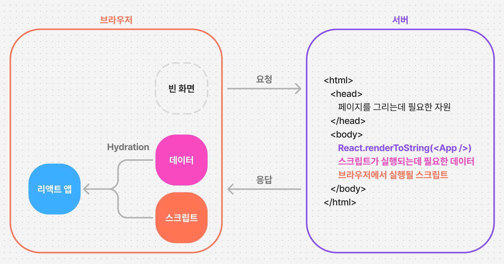

# React Router V7와 웹 플랫폼, 근데 이제 Fastify를 곁들인

## 배경
- 대부분 SSR을 위해 Next.js를 사용해보셨을거라고 생각해요.
- Next.js는 첫 시작으로는 매우 좋은 프레임워크라고 생각하지만, 프로덕션 환경에서 나의 상황과 환경에 맞게 뜯어쓰기에, 그리고 SSR 환경을 세세히 이해하기에 React Router가 조금 더 적절하다는 생각을 해요.
- 이런 부분에서 제가 좋아하는 React Router V7(a.k.a. Remix)을 함께 따라해보며 배워보고, React Router를 우리가 앞서 만든 Fastify 앱에 끼워서 풀스택 앱 셋팅을 실제로 해봐요.
 
## Next.js vs React Router (a.k.a. Remix)
[함께 읽어봐요](https://www.epicweb.dev/why-i-wont-use-nextjs)
- “Remix에 능숙해지면 웹에 대해서도 더 잘 알게 되고, 그 반대의 경우도 마찬가지입니다.”
  - “As you get better at Remix, you get better at the web and vice versa.”
 
## React Router의 구성요소
### 웹 프레임워크는 크게 아래의 문제를 해결해야하는데요.
- 빌드를 어떻게 하는가?
- 서빙을 어떻게 하는가? (HTML이 어떻게 내려오는가?)
- 코드를 어떻게 짜는가?
 
### Next.js는 해당 문제를 아래와 같이 해결했어요.
- 빌드를 어떻게 하는가? → Webpack을 코드 내에 삽입하여 개조하여 사용. Turbopack 준비중
- 서빙을 어떻게 하는가? → 서빙 로직을 작성 및 커스텀 로직과 Vercel 플랫폼 기능을 활용
- 코드를 어떻게 짜는가? → pages 디렉토리, app 디렉토리와 React Server Component
 
### React Router는 해당 문제를 아래와 같이 해결해요.
- 빌드를 어떻게 하는가? → Vite와 Vite 플러그인 사용.
- 서빙을 어떻게 하는가? → Adaptor 기반으로 다양한 환경(Node.js, Cloudflare Workers 등)에 배포 가능.
- 코드를 어떻게 짜는가? → loader, action과 같은 Web 표준 시맨틱(의미, 인터페이스) 활용.
 
따라서 React Router를 설치하게 되면,
1. Vite가 설치되고
2. Vite 빌드의 결과물로 클라이언트 빌드와 서버 빌드가 나오게 되며
3. 서빙 로직이 Node.js에서 실행 (react-router-serve) 되게 돼요.
 
>🔥웹 플랫폼?
오늘 “웹 플랫폼”이라는 단어들이 많이 등장하게 되는데요. 저는 우리가 리액트 개발자이기 이전에 “웹 개발자”여야하고, 최신 기술도 좋지만 이러한 근본 지식에 관심을 갖고 능숙해져야 한다고 생각해요. 늘 제가 이야기하는 Cache-Control 헤더를 포함해, Request, Response와 같은 객체와, URL, URLSearchParams 와 같은 객체들에 익숙해지시길 바래요.

> ⚠️혹시 qs, querystring 패키지를 사용하시나요?
웹 플랫폼을 사용하셔야해요. new URLSearchParams()를 쓰셔야 합니다. 라이브러리는 일시적이지만 웹 플랫폼은 영원합니다.
 
## SSR은 어떻게 동작하는가?
Server-side Rendering은 간략히는 아래와 같이 동작하게 되어요. 다양한 과정이 있겠지만 만약 프레임워크를 쓰시게 된다면
1. HTML이 어떻게 만들어지는지
2. Hydration이 어떻게 이루어지는지

두가지 부분은 어느정도 이해를 하고 가시는게 좋다고 생각해요.

>😅Disclaimer: 위 다이어그램은 전통(?)적인 SPA 프레임워크들의 SSR 방식을 표현했어요. RSC와 같은 새로운 개념에는 맞지 않을 수 있으니 참고 부탁드려요.
 
## React Router 시작하기
아래 커맨드로 React Router 프로젝트를 시작할 수 있어요
```
$ yarn create react-router
```
 
프로젝트가 Scaffold 되었다면, 개발 서버를 켜고 잘 동작하는지 index 페이지에 접속해봐요.
```
$ yarn dev
```
 
빌드를 해볼까요?
```
$ yarn build
```
 
빌드 결과를 시작해볼게요
```
$ yarn start
```
 
### HTML 살펴보기
혹시 SSR을 통해 내려온 HTML을 유심히 살펴보신 적이 있나요? 한번 살펴볼까요? (Demo)
 
### 라우팅 등록하기
라우팅을 등록하기 위해서는 `./app/routes.ts`를 수정하시면 돼요.
- 혹시 Next.js의 pages 같은것을 찾으신다면, 아래 패키지를 사용하시면 됩니다.
```
$ yarn add @react-router/fs-routes
```
```TypeScript
import { flatRoutes } from "@react-router/fs-routes";

// as-is:
export default [
	//...
] satisfies RouteConfig;

// to-be:
export default flatRoutes();
```
 
### Loader 등록하기
컴포넌트에 필요한 데이터를 불러오기 위해서 Loader를 사용할 수 있어요. 아래와 같이 사용할 수 있습니다.
```TypeScript
// route가 가리키는 컴포넌트가 있는 파일에서
export default MyPage() {
  // ...
}

// loader 함수를 노출
export function loader() {
  // ...
}
```
 
라우트에 맞는 TypeScript 타입을 먹여주기 위해 `$ yarn dev` 수행시 뒤에서 Codegen을 자동으로 수행하고 있을거에요. 아래와 같이 생성된 타입을 가져와서 사용할 수 있습니다.
```TypeScript
import type { Route } from "./+types/article";

export function loader({ params }: Route.LoaderArgs) {
  // ...
}
```
 
### Action과 Form
원하는 데이터를 불러오는것까지는 무리없이 따라가실 수 있을텐데요. 글쓰기 또는 글 수정 등의 정보 수정은 어떻게 구현하면 좋을까요? 이를 웹 표준 형태로 구현하기 위해 React Router에서는 `action()` 과 `<Form />` 컴포넌트를 활용하는 식으로 만들어놓았어요.
```TypeScript
// route('/projects/:projectId', './project.tsx')

import type { Route } from "./+types/project";
import { Form } from "react-router";
import { fakeDb } from "../db";

export async function action({
  request,
}: Route.ActionArgs) {
  let formData = await request.formData();
  let title = formData.get("title");
  let project = await fakeDb.updateProject({ title });
  return project;
}

export default function Project({
  actionData,
}: Route.ComponentProps) {
  return (
    <div>
      <h1>Project</h1>
      <Form method="post">
        <input type="text" name="title" />
        <button type="submit">Submit</button>
      </Form>
      {actionData ? (
        <p>{actionData.title} updated</p>
      ) : null}
    </div>
  );
}
```

가장 재밌는 부분은 이렇게 코딩을 하게 되면, 실제로 웹 표준(`<form />`)으로도 동작하는 구현이 만들어지기 때문에 JavaScript를 끄더라도 정상적으로 동작하게 됩니다(!)
>💡UX 향상을 위한 JavaScript
JavaScript의 초창기를 떠올려봐요. JavaScript는 정적이였던 HTML/CSS를 동적으로 조작해 좀 더 웹 문서를 생동감있게 표현하고자 탄생했는데요. SPA 시대로 들어서면서 JavaScript가 중심으로 오게되고, 웹 기술은 뒷전이 되곤 했어요. React Router는 그런 흐름에서 근본적인 웹 기술에 대한 관심을 촉구해요. 웹 서버와 HTML로도 충분했다는 사실을요.
>
>⇒ (1) HTML만 있어도 웹은 정상적으로 작동해야하고 (2) 만약 JavaScript가 가능하다면 더 빠른 웹 앱이 되도록 해야해요. JavaScript는 핵심이 아니에요. 웹이 핵심이에요.
 
## React Router와 Fastify 함께 사용하기
React Router를 실제로 제품에 사용해보는건 숙제로 남겨둘게요. (시간이 없잖아요?!) 자 그럼 이제 또 하나의 중요한 부분인 Fastify 서버와 상호운용하는 것을 해볼거에요. React Router를 Fastify와 함께 사용하기 위해서는 아래 패키지를 사용하면 좋아요.
```
$ yarn add @mcansh/remix-fastify
```
 
### Fastify에 등록하기
아래와 같이 Fastify 앱에 플러그인 형태로 React Router 앱을 등록할 수 있어요.
```TypeScript
import fastify from "fastify";
import { reactRouterFastify } from "@mcansh/remix-fastify/react-router";

const app = fastify();

await app.register(reactRouterFastify);
```
 
### 결론
이 정도면 React Router(a.k.a. Remix)에 충분히 흥미가 생기셨으리라고 생각해요. 저는 지난 2년간 Remix, React Router를 적극적으로 활용하고 있으며 매우 만족하고 있어요.
- 어느정도 규모의 트래픽 (초당 400~)에도 운영하기에 부족함이 없었고,
- 새로운 버전이 등장할때도 두려움보다는 안정감과 기대감이 앞섰어요.
- Vite 생태계에서도 적극적으로 지원하는 만큼 Rolldown 프로젝트를 통한 빌드 속도 향상도 기대해볼 수 있겠죠